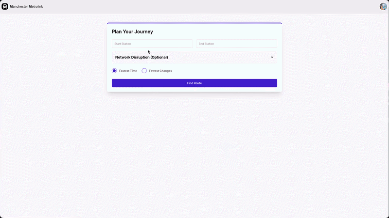
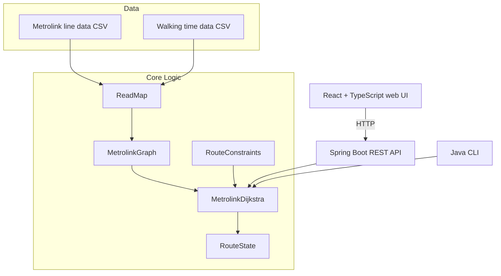

# Manchester Metrolink Journey Planner

A full-stack journey planner for the Manchester Metrolink tram network. Give it a start and destination station and it finds the fastest route, or the route with the fewest line changes, using a custom Dijkstra implementation over real Metrolink line and walking-time data — with support for simulating station closures and delays.

Built as three separate applications sharing the same core pathfinding logic: a **Spring Boot REST API**, a **React web frontend**, and a standalone **Java CLI**.



## Features

- **Two routing strategies**: fastest time, or fewest line changes, computed with a real priority-queue Dijkstra implementation (not a third-party graph library)
- **Line changes are modeled explicitly**: a configurable time penalty is applied whenever a route switches lines, so "fastest" reflects the real cost of changing trains
- **Walking legs**: some stations are close enough to walk between; the planner treats walking as its own "line" and will suggest it when it's faster
- **Live disruption simulation**: close a station or add a custom delay between two stations and see how the route recalculates around it
- **Three interfaces, one algorithm**: a REST API, a web UI with route visualizations, and a terminal app, all built on the same graph and pathfinding logic

## Architecture



The pathfinding core (`MetrolinkGraph`, `MetrolinkDijkstra`, `RouteState`, `RouteConstraints`, `ReadMap`) is currently duplicated between `backend/` and `cli/`, kept in sync by hand. Extracting it into a shared module both depend on is the next planned change — see [Known limitations](#known-limitations).

| Module | Stack | What it does |
|---|---|---|
| `backend/` | Java 21, Spring Boot, Maven | REST API exposing `/api/journey/route`; loads the network into memory once at startup |
| `frontend/` | React, TypeScript, Vite, Tailwind + daisyUI, Chart.js, Axios | Web UI: journey form, disruption controls, route breakdown, and charts comparing both routing strategies |
| `cli/` | Java 21, plain `javac` (no build tool) | Interactive terminal version of the same planner, for use without a server or browser |

## API reference

**`GET /api/journey/route`**

| Param | Type | Required | Description |
|---|---|---|---|
| `start` | string | yes | Starting station name |
| `end` | string | yes | Destination station name |
| `optimisedRoute` | boolean | yes | `true` for fastest time, `false` for fewest changes |
| `station` | string | no | A station to treat as closed for this request |
| `delayFrom`, `delayTo` | string | no | Endpoints of a connection to apply a custom delay to |
| `delayTime` | integer | no | New total travel time (minutes) for the `delayFrom`→`delayTo` connection |

```bash
curl "http://localhost:8080/api/journey/route?start=Victoria&end=Piccadilly&optimisedRoute=true"
```

```json
{
  "totalTime": 14.0,
  "totalChanges": 1,
  "path": [
    { "station": "Victoria", "line": "start", "actualTime": 0.0 },
    { "station": "Market Street", "line": "green", "actualTime": 5.0 },
    { "station": "Piccadilly", "line": "yellow", "actualTime": 14.0 }
  ]
}
```

On failure (no route found, a closed start/end station, or identical start and end), the API returns a 400 with `{ "error": "..." }`.

## Getting started

### Backend

Requires Java 21 and Maven (or use the bundled wrapper).

```bash
cd backend
./mvnw spring-boot:run
```

Runs on `http://localhost:8080`. The Metrolink network is loaded from CSV files in `src/main/resources/utils/` once at startup.

### Frontend

Requires Node.js.

```bash
cd frontend
npm install
npm run dev
```

Runs on `http://localhost:5173` and expects the backend to be running on `localhost:8080` (configurable via `VITE_API_BASE_URL` — see `.env.example`).

### CLI

Requires a JDK. No build tool — compiled directly with `javac`.

```bash
cd cli
javac -d bin src/Main.java src/modules/*.java
java -cp bin Main
```

## Testing

```bash
cd backend
./mvnw test
```

Covers the pathfinding algorithm directly: both routing strategies, station closures, delays, and edge cases like no route existing or identical start/end stations.

The CLI doesn't currently have a test setup (no build tool to run JUnit against) — the pathfinding logic it uses is the same code covered by the backend's tests.

## Engineering notes

A few decisions worth calling out, since the reasoning matters more than the diff:

- **The routing engine doesn't mutate shared state.** An earlier version had the REST API closing stations and adding delays directly on the shared `MetrolinkGraph` instance, then undoing those changes once a route was found. Since that instance is a single Spring-managed bean shared across every concurrent request, two overlapping requests could interleave their mutations — one request's cleanup could silently remove a closure another request still depended on. `MetrolinkGraph` is now pure, read-only topology built once at startup; closures and delays for a single request live in a `RouteConstraints` object built fresh per call and passed straight into the pathfinding function. No locking needed, because there's nothing left to lock.
- **Line changes carry a real cost, not just a counter.** The "fewest changes" mode doesn't just minimize a change count independently of time — the priority queue's cost function switches between total time and total changes depending on which mode is selected, so both modes are genuinely optimizing the route, not applying a fixed penalty after the fact.

## Known limitations

- `backend/` and `cli/` currently maintain separate copies of the same pathfinding code (`MetrolinkGraph`, `MetrolinkDijkstra`, `RouteState`, `RouteConstraints`, `ReadMap`). Extracting these into a shared `metrolink-core` module both depend on is the next planned change.
- Station name matching is case-insensitive on the CLI (fuzzy lookup against the loaded station list) but exact-match on the REST API — a station name typed with the wrong case into the web UI will currently fail to find a route rather than being corrected.
- No persistence: closures and delays exist only for the lifetime of a single request/session; nothing is saved between runs.

## License

MIT